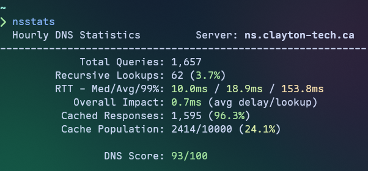

# nsstats

A simple terminal-based DNS statistics viewer for [Technitium DNS Server](https://technitium.com/dns/), written in Nim.



## Features

- **Live DNS statistics** displayed in a dynamically colorized terminal interface
- **Time range selection** - View hourly (updated minutely), daily (updated hourly), or weekly (updated daily) statistics
- **Performance metrics** including recursive response times (median, average, 99th percentile)
- **Resolver health indicator** - Shows the performance of your configured resolver based on your Internet connection
- **Cache efficiency tracking** with hit/miss rates and population stats
- **DNS Score** - Composite experience score (0-100) based on multiple metrics, gives you an at-a-glance idea of your DNS performance
- **First-run configuration wizard** for easy setup

## Requirements

- **Only Linux is supported at this time**
- A [Technitium DNS Server](https://technitium.com/dns/) instance with the **Query Logs (SQLite) App** installed
  - Must be configured to use the **in-memory database** option for performance reasons.
- A Technitium API token with the following permissions:
  - `Dashboard:View`
  - `Settings:View`
  - `Logs:View`

## Installation

### Download Binary

Download the latest release from the [GitHub Releases](https://github.com/sjclayton/nsstats/releases) page.

### Build from Source

```bash
# Clone the repository
git clone https://github.com/sjclayton/nsstats.git
cd nsstats

# Build release binary
nimble release -y
```

The compiled binary will be at `bin/nsstats`, you can place it in your `$PATH` or copy it
to another location of your choice for convenience.

**Prerequisites for building:**

- Nim compiler >= 2.2.10
- nimble package manager

## Usage

On first run, nsstats will prompt you to configure your Technitium DNS Server connection:

```bash
nsstats
```

If no option is provided, shows current (last hour) stats.

### Command Line Options

```
Usage: nsstats [OPTIONS]

Options:
  -d, --daily    Show daily stats (last 24 hours)
  -w, --weekly   Show weekly stats (last 7 days)
  -c, --config   Use an alternate config file (-c /path/to/config.toml)
  -h, --help     Show this help message
```

## Configuration

Configuration is stored in TOML format at:

- `$XDG_CONFIG_HOME/nsstats/config.toml` or
- `~/.config/nsstats/config.toml`

Example configuration:

```toml
host = "192.168.1.1"
port = "5380"
token = "your-api-token-here"
```

Generate an API token from the Technitium DNS Server web console under `Administration > Sessions`.

## Displayed Metrics

| Metric                 | Description                                                                             |
| ---------------------- | --------------------------------------------------------------------------------------- |
| **Total Queries**      | Total number of DNS queries processed (recursive/cached only)                           |
| **Recursive Lookups**  | Queries requiring recursive resolution (with miss rate %)                               |
| **Median/Avg/99% RTT** | Round-trip response time statistics (recursive lookups only)                            |
| **Resolver Health**    | Optimal (<10ms), Fair (<20ms), or Degraded (your ISP connection's effect on resolution) |
| **Overall Impact**     | Average delay per lookup (weighted by recursive/total queries ratio)                    |
| **Cached Responses**   | Responses served from the cache (with hit rate %)                                       |
| **Cache Population**   | Ratio of cached entries to configured maximum cache size                                |
| **DNS Score**          | Composite experience score (0-100) based on weighted metrics                            |

## License

MIT License - see [LICENSE](LICENSE) file for details

## Links

- [Technitium DNS Server](https://technitium.com/dns/)
- [Technitium API Documentation](https://github.com/TechnitiumSoftware/DnsServer/blob/master/APIDOCS.md)
