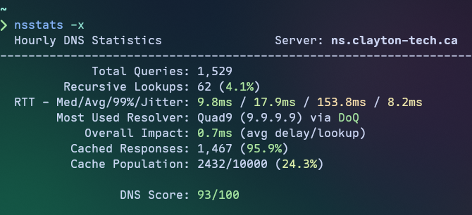

# nsstats

A simple terminal-based DNS statistics viewer for [Technitium DNS Server](https://technitium.com/dns/), written in Nim.

## Screenshots

**Core Metrics (default)**


**w/Extra Metrics**



## Features

- **Live DNS statistics** displayed in a dynamically colorized terminal interface
- **Time range selection** — View hourly (updated minutely), daily (updated hourly), or weekly (updated daily) statistics
- **Performance metrics** including recursive response times (median, average, 99th percentile)
- **Cache efficiency tracking** with hit/miss rates and population stats
- **DNS Score** — Composite experience score (0-100) based on multiple metrics, gives you an at-a-glance idea of your DNS performance
- **First-run configuration wizard** for easy setup

## Requirements

- **Only Linux is supported at this time**
- A [Technitium DNS Server](https://technitium.com/dns/) instance with the **Query Logs (SQLite) App** installed
  - Must be configured to use the **in-memory database** option for performance reasons.
- A Technitium API token with the following permissions:
  - `Dashboard:View`
  - `Settings:View`
  - `Logs:View`
  - `Cache:View` (only needed for extra metrics, used by the most used resolver metric)

## Installation

### Download Binary

Download the latest release from the [GitHub Releases](https://github.com/sjclayton/nsstats/releases) page.

### Build from Source

```bash
# Clone the repository
git clone https://github.com/sjclayton/nsstats.git
cd nsstats

# Build debug (development) binary
nimble debug

# Build release binary
nimble release
```

The compiled binary will be at `bin/nsstats`, you can place it in your `$PATH` or copy it
to another location of your choice for convenience.

**Prerequisites for building:**

- Nim compiler >= 2.2.10
- nimble package manager

## Usage

On first run, nsstats will prompt you to configure your Technitium DNS Server connection:

```bash
nsstats
```

If no option is provided, shows current (last hour) stats.

### Command Line Options

```
Usage: nsstats [OPTIONS]

Options:
  -d, --daily    Show daily stats (last 24 hours)
  -w, --weekly   Show weekly stats (last 7 days)
  -x, --extra    Show extra metrics (Resolver Health, Most Used Resolver)
  -c, --config   Use an alternate config file (-c /path/to/config.toml)
  -v, --version  Show current version
  -h, --help     Show this help message
```

## Configuration

Configuration is stored in TOML format at:

- `$XDG_CONFIG_HOME/nsstats/config.toml` or
- `~/.config/nsstats/config.toml`

Example configuration:

```toml
conn_mode = "http" # Options: "http", "https"
host = "192.168.1.1"
port = "5380" # Defaults: HTTP -> 5380, HTTPS -> 53443
token = "your-api-token-here"
extra_metrics = false # Show extra metrics (Resolver Health, Most Used Resolver)
```

Generate an API token from the Technitium DNS Server web console under `Administration > Sessions`.

## Displayed Metrics

### Core Metrics

| Metric                 | Description                                                          |
| ---------------------- | -------------------------------------------------------------------- |
| **Total Queries**      | Total number of DNS queries processed (recursive/cached only)        |
| **Recursive Lookups**  | Queries requiring recursive resolution (with miss rate %)            |
| **Median/Avg/99% RTT** | Round-trip response time statistics (recursive lookups only)         |
| **Overall Impact**     | Average delay per lookup (weighted by recursive/total queries ratio) |
| **Cached Responses**   | Responses served from the cache (with hit rate %)                    |
| **Cache Population**   | Ratio of cached entries to configured maximum cache size             |
| **DNS Score**          | Composite experience score (0-100) based on weighted metrics         |

### Extra Metrics

The following metrics require `-x`/`--extra` or `extra_metrics = true` in your config file:

| Metric                 | Description                                                                        |
| ---------------------- | ---------------------------------------------------------------------------------- |
| **Jitter**             | Network conditions current effect on upstream resolution (displayed with RTT's)    |
| **Most Used Resolver** | Upstream resolver with highest response rate - shows name, IP, and protocol in use |

## Contributing

Anyone who wishes to contribute is welcome to open an issue or submit a pull request.

## License

MIT License - see [LICENSE](LICENSE) file for details

## Links

- [Technitium DNS Server](https://technitium.com/dns/)
- [Technitium API Documentation](https://github.com/TechnitiumSoftware/DnsServer/blob/master/APIDOCS.md)
